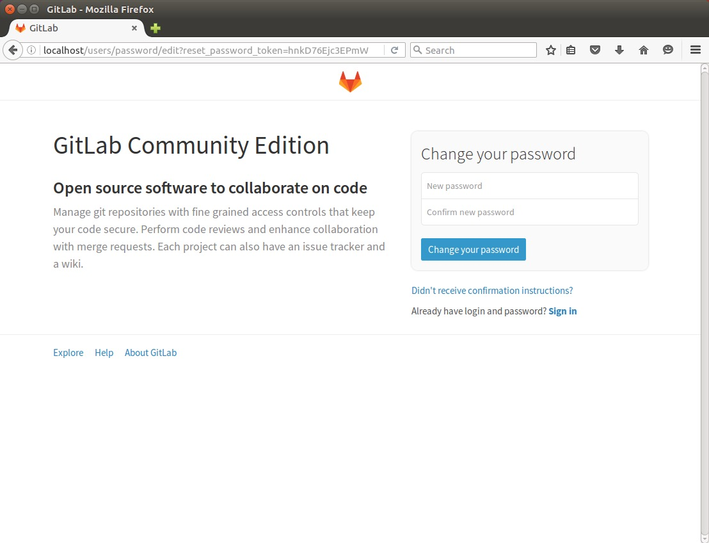
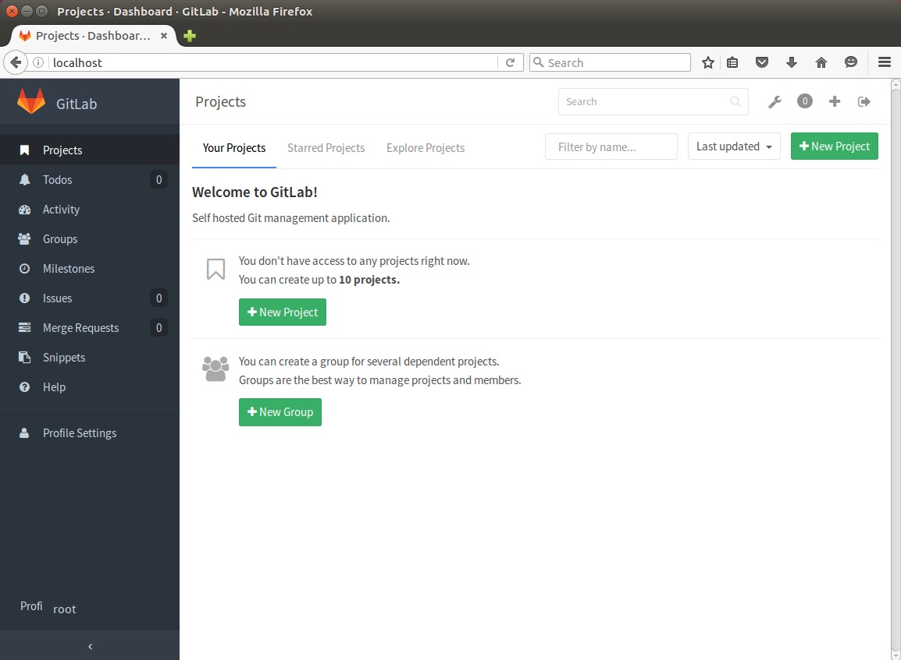

　　毕业后，遇到的公司都是使用SVN作为源代码管理工具，本来也觉得没什么十分大的不便。后来接触了GitHub，还有Git工作流等之后，发现SVN在团队合作的时候，有相当多的不足。另外，出于私人的一些原因，我的写的一些代码中，有一部分是开源放在GitHub上的，要Git与SVN协作管理一份代码，实在困难。

　　后面萌生了把Git引入公司，替换SVN成为我们的新源代码管理器的想法。在网上搜了一下之后，发现GitLab与GitHub相似度蛮高，并且有CE版（社区版，免费），同时支持持续集成。感觉非常合适。后面说服老大之后，开始折腾Gitlab。

　　其实GitLab的安装过程非常简单，只不过有安装文档是全英文的，而且由于国内网速真的被墙得太厉害了，完完全全按照上面的过程安装的话，基本安装不成功的。这篇博记录了我的一个安装过程，以供参考。

### 安装Git
　　GitLab并没有安装Git，所以第一步，应该把Git安装到系统中。安装Git非常简单，命令行用apt-get安装即可。

```bash
sudo apt-get install git
```
　　安装完毕后验证一下。

```bash
git --version
# git version 2.7.4 如果输出这个，说明Git安装成功了
```

### 安装Ruby
　　GitLab是使用Ruby编辑的Git管理中心，依赖Ruby2.0以上。在[Ruby](http://www.ruby-lang.org/en/)官网下载最新版[Ruby 2.3.0](https://cache.ruby-lang.org/pub/ruby/2.3/ruby-2.3.0.tar.gz)，将tar.gz解压到桌面。依次输入以下命令，Ruby就安装好了。

```bash
cd ~/Desktop/ruby-2.3.0/
./configure
sudo make && sudo make install
```
　　同样安装完毕后验证一下。

```bash
ruby --version
# ruby 2.3.0p0 (2015-12-25 revision 53290) [x86_64-linux]
```
### 安装GitLab依赖
　　接下来就按着官网的[安装说明](https://about.gitlab.com/downloads/#ubuntu1604)，先安装GitLab需要的依赖。

```bash
sudo apt-get install curl openssh-server ca-certificates postfix
```

> 这里需要补充说明一下，安装postfix的时候，会弹出GUI，让你选择`General type of mail configuration`，这里选择默认的`Internet Site`。`System mail name`随意填。

### 下载GitLab安装包
　　官方文档是使用`curl`来下载安装包的，但是国内网络速度太慢了，万一网络中断一下，就悲剧了，所以还是自己手动用工具下载更稳当。去[官方下载地址](https://packages.gitlab.com/gitlab/gitlab-ce)里选择最新版的GitLab。GitLab更新速度非常快，堪称版本帝，平均2至3天升级一次。选择`ubuntu/xenial`版本下载。

### 安装GitLab
　　将刚才下载的`gitlab-ce_x.x.x-ce.0_amd64.deb`移动到桌面，然后安装。

```bash
sudo dpkg -i ~/Desktop/gitlab-ce_x.x.x-ce.0_amd64.deb
```

### 应用GitLab
　　GitLab已经安装完毕了，接下来使用以下命令让GitLab生效。

```bash
sudo gitlab-ctl reconfigure
```

### 访问GitLab
　　打开浏览器，输入`http://localhost`，就可以访问GitLab了。



　　第一次访问的时候，系统会让你重置密码。然后使用帐号`root`和你的新密码，就可以登录GitLab了。


　　至此，GitLab搭建完成了。