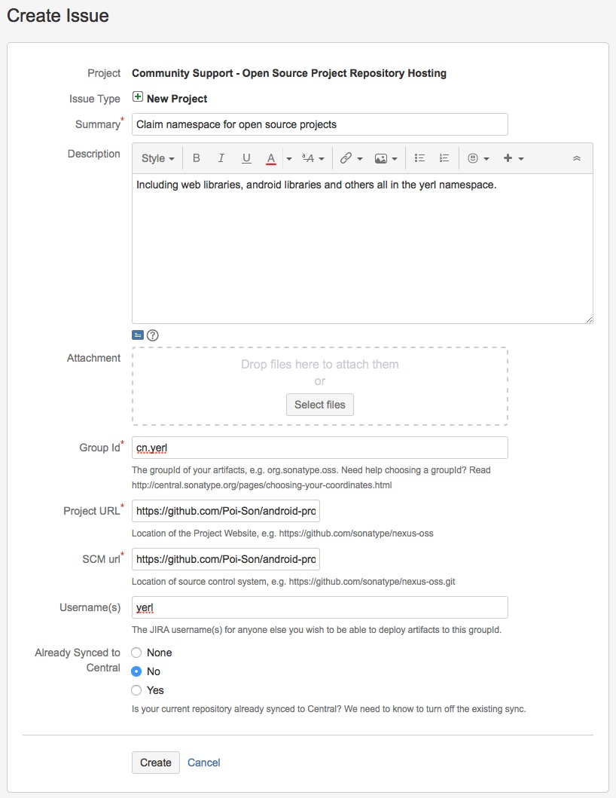
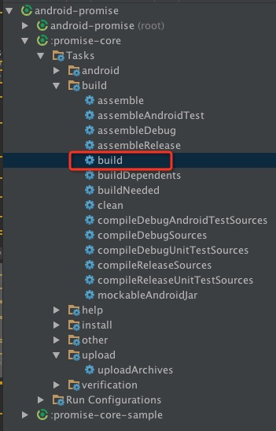
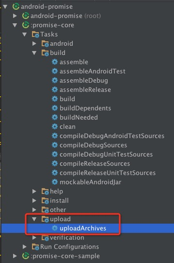
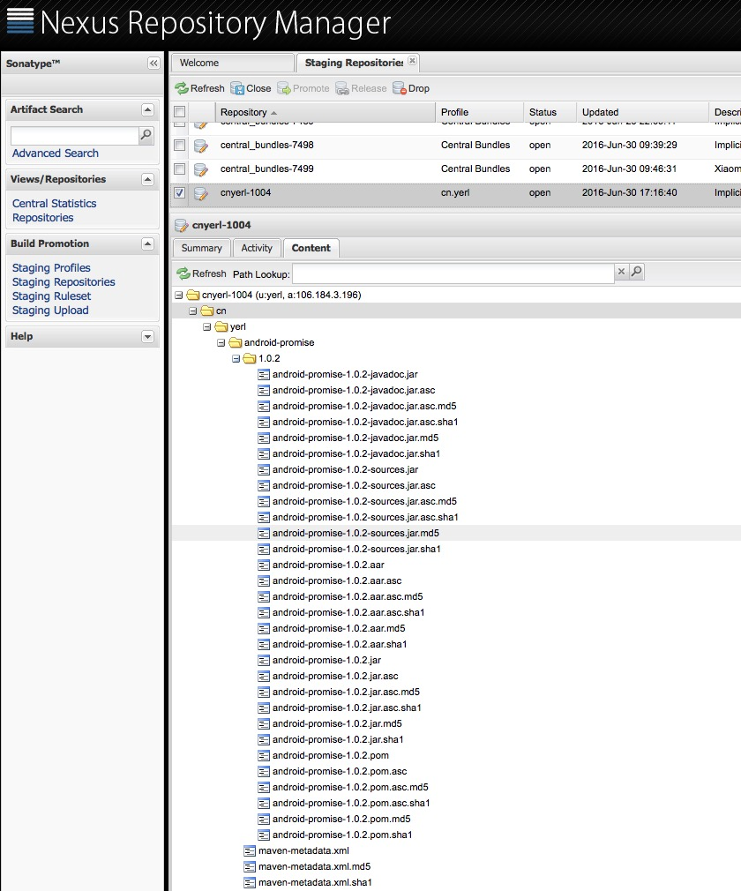

　　现在Maven几乎成了Java事实上的包管理工具了，Gradle作为后起之秀，也是建立在Maven现有的大量仓库资源之上。使用Maven Central Repository可以很方便地解决第三方库依赖问题。那么，如何将自己开发的包也发布到Maven Central Repository上去呢？

　　[Sonatype](http://central.sonatype.org)提供开源项目仓库托管(Open Source Software Repository Hosting，简称OSSRH)服务。但是发布到Sonatype的过程还是比较麻烦的，还是写个博客记录一下。

## 申请空间
　　在Sonatype发布项目，首先得在中央库里申请空间。这个空间可以理解为*Group ID*，即你的项目都是放在这个目录之下。

### 注册JIRA

　　在[这里](https://issues.sonatype.org/secure/Signup!default.jspa)注册一个Sonatype的JIRA帐号。这个没什么好说的，跳过。

### 申请空间

　　在[这里](https://issues.sonatype.org/secure/CreateIssue.jspa?issuetype=21&pid=10134)填写一个表单。



**特别注意这几项**

- Group Id：填写你的域名，如果没有域名可以用GitHub的域名(com.github.username)。
- Project URL：GitHub的项目地址
- SCM url：GitHub项目的*git clone*地址

　　填写完了之后提交。一般来说2个工作日内，这个Issue的状态会变成`RESOLVED`状态。同时，有一个邮件会发送到你的注册邮箱，邮件正文会附上Sonatype Nexus的上传等地址。

```
Configuration has been prepared, now you can:
* Deploy snapshot artifacts into repository https://oss.sonatype.org/content/repositories/snapshots
* Deploy release artifacts into the staging repository https://oss.sonatype.org/service/local/staging/deploy/maven2
* Promote staged artifacts into repository 'Releases'
* Download snapshot and release artifacts from group https://oss.sonatype.org/content/groups/public
* Download snapshot, release and staged artifacts from staging group https://oss.sonatype.org/content/groups/staging

please comment on this ticket when you promoted your first release, thanks
```

> 由于是第一次提交，所以在完成后面的步骤后，需要回来回复一下JIRA的Issue。

## 上传库
　　这里以安卓库为例子。

### GnuPG

　　安装GnuPG。在[下载页面](https://www.gnupg.org/download/)最下方，按你自己的系统选择对应的安装包。我选择了OS X。安装完之后，使用命令行生成密码。

```bash
$ gpg --gen-key
```
　　根据提示填写姓名、邮箱、备注等。生成完了之后，可以用以下命令查看key内容。

```bash
$ gpg --list-keys
/Users/PoiSon/.gnupg/pubring.gpg
--------------------------------
pub   2048R/E2F25563 2016-06-29
uid       [ultimate] poison (yerl) <git@yerl.cn>
sub   2048R/5D8F2176 2016-06-29
```
　　`E2F25563`是key id，需要将它上报给服务器。

```bash
gpg --keyserver hkp://pool.sks-keyservers.net --send-keys E2F25563
```
　　如果还不是很清楚，可以查看[官方指导](http://central.sonatype.org/pages/working-with-pgp-signatures.html)。

### 生成库
　　Android Studio使用Gradle作为项目编译、库依赖工作，那么这里就以Gradle为例子，看如何生成jar包并上传到Sonatype的服务器上。

　　将以下的内容复制到Android Studio项目下的根目录下的*upload.gradle*文件里。

`upload.gradle`

```ruby
apply plugin: 'maven'
apply plugin: 'signing'

afterEvaluate { project ->
    uploadArchives {
        repositories {
            mavenDeployer {
                beforeDeployment { MavenDeployment deployment -> signing.signPom(deployment) }

                repository(url: RELEASE_REPOSITORY_URL) {
                    authentication(userName: NEXUS_USERNAME, password: NEXUS_PASSWORD)
                }
                snapshotRepository(url: SNAPSHOT_REPOSITORY_URL) {
                    authentication(userName: NEXUS_USERNAME, password: NEXUS_PASSWORD)
                }

                pom.project {
                    groupId POM_GROUP_ID
                    artifactId POM_ARTIFACT_ID
                    version POM_VERSION
                    packaging POM_PACKAGING

                    name SONATYPE_NAME
                    description SONATYPE_DESCRIPTION
                    url SONATYPE_URL

                    licenses {
                        license {
                            name SONATYPE_LICENCE_NAME
                            url SONATYPE_LICENCE_URL
                        }
                    }

                    developers {
                        developer {
                            name SONATYPE_DEVELOPER_NAME
                            email SONATYPE_DEVELOPER_EMAIL
                        }
                    }

                    scm {
                        connection SONATYPE_SCM_CONNECTION
                        developerConnection SONATYPE_SCM_DEVELOPER_CONNECTION
                        url SONATYPE_SCM_URL
                    }
                }
            }
        }
    }

    task installArchives(type: Upload) {
        description "Installs the artifacts to the local Maven repository."
        configuration = configurations['archives']
        repositories {
            mavenDeployer {
                pom.groupId = POM_GROUP_ID
                pom.artifactId = POM_ARTIFACT_ID
                pom.version = POM_VERSION

                repository url: "file://${System.properties['user.home']}/.m2/repository"
            }
        }
    }

    signing {
        sign configurations.archives
    }

    task androidJavadocs(type: Javadoc) {
        source = android.sourceSets.main.java.srcDirs
        classpath += project.files(android.getBootClasspath().join(File.pathSeparator))
    }

    task androidJavadocsJar(type: Jar, dependsOn: androidJavadocs) {
        classifier = 'javadoc'
        from androidJavadocs.destinationDir
    }

    task androidSourcesJar(type: Jar) {
        classifier = 'sources'
        from android.sourceSets.main.java.srcDirs
    }

    artifacts {
        archives androidSourcesJar
        archives androidJavadocsJar
    }
}
```
　　这段Gradle脚本用于生成Sonatype Nexus要求的所有文件，包括

- `xxxx-xxxx.jar` 库的打包文件。Android的库文件后缀名为aar。
- `xxxx-xxxx.jar.asc` PGP签名
- `xxxx-xxxx-javadoc.jar` 项目生成的document
- `xxxx-xxxx-javadoc.jar.asc` PGP签名
- `xxxx-xxxx-sources.jar` 项目的源代码
- `xxxx-xxxx-sources.jar.asc` PGP签名

　　同时，这段脚本还可以将生成的文件、pom等上传到Sonatype Nexus服务器上。

　　修改*gradle.properties*，按需修改以下属性设置。

`gradle.properties`

```ruby
# POM属性设置
POM_VERSION=1.0.1
POM_GROUP_ID=cn.yerl
POM_ARTIFACT_ID=android-promise
POM_PACKAGING=aar

# sonatype.org要求的相关属性
#-> Project Name, Description and URL
SONATYPE_NAME=Android Promise Core
SONATYPE_DESCRIPTION=A promise implementation for Android
SONATYPE_URL=https://github.com/Poi-Son/android-promise

#-> License Information
SONATYPE_LICENCE_NAME=The Apache Software License, Version 2.0
SONATYPE_LICENCE_URL=https://www.apache.org/licenses/LICENSE-2.0.txt

#-> Developer Information
SONATYPE_DEVELOPER_NAME=yerl
SONATYPE_DEVELOPER_EMAIL=git@yerl.cn

#-> SCM Information
SONATYPE_SCM_CONNECTION=scm:git:git@github.com:Poi-Son/android-promise.git
SONATYPE_SCM_DEVELOPER_CONNECTION=scm:git:git@github.com:Poi-Son/android-promise.git
SONATYPE_SCM_URL=git@github.com:Poi-Son/android-promise.git


# 如果想上传到私服,则将这个改成私服的地址
RELEASE_REPOSITORY_URL=https://oss.sonatype.org/service/local/staging/deploy/maven2
SNAPSHOT_REPOSITORY_URL=https://oss.sonatype.org/content/repositories/snapshots
```

　　另外，由于上传时需要帐号密码、密钥相关信息，如果将这些信息放在项目下的`gradle.properties`里，并上传到GitHub上的话，会造成信息泄露。因此，可以将这些信息放在*~/.gradle/gradle.properties*文件里。

```ruby
# NEXUS用户名和密码
NEXUS_USERNAME=your nexus username
NEXUS_PASSWORD=your nexus password

# 密钥配置
signing.keyId=your pgp key id
signing.password=your gpg password
signing.secretKeyRingFile=your gpg secring file
```

> signing.secretKeyRingFile的目录一般是这样的：*~/.gnupg/secring.gpg*

　　修改一下库项目的*build.gradle*文件。

`build.gradle`

```ruby
apply plugin: 'com.android.library'
apply from: '../upload.gradle'

android {
    compileSdkVersion 24
    buildToolsVersion "24.0.0"

    defaultConfig {
        minSdkVersion 14
        targetSdkVersion 24
    }

    lintOptions {
        xmlReport false
        warningsAsErrors true
        quiet false
        showAll true
        disable 'OldTargetApi'
    }

    compileOptions {
        sourceCompatibility JavaVersion.VERSION_1_7
        targetCompatibility JavaVersion.VERSION_1_7
    }
}

afterEvaluate { project ->
    android.libraryVariants.all { variant ->
        tasks.androidJavadocs.doFirst {
            classpath += files(variant.javaCompile.classpath.files)
        }
    }
}

dependencies {
    compile fileTree(dir: 'libs', include: ['*.jar'])
    testCompile 'junit:junit:4.12'
}
```
　　在gradle运行build任务



　　如果以上配置都正确的话，你应该在该项目下的*build/libs*目录下找到4个文件。

- `xxxx-xxxx-javadoc.jar`
- `xxxx-xxxx-javadoc.jar.asc`
- `xxxx-xxxx-sources.jar`
- `xxxx-xxxx-sources.jar.asc`

### 上传库
　　生成好库之后，就需要将它上传到Sonatype Nexus里去了。上传非常简单，运行Gradle uploadArchives任务就可以了。



　　当在Android的控制台上看到`BUILD SUCCESSFUL`，我们来到[Sonatype Nexus Repository Manager](https://oss.sonatype.org/#welcome)，来看看是否上传成功了。

> 如果你在控制台上看到*Could not find metadata cn.yerl:android-promise/maven-metadata.xml in remote (https://oss.sonatype.org/service/local/staging/deploy/maven2)*，不需要理会。

　　登录后，在左侧菜单选择*Staging Repositories*菜单。在打开的菜单的列表里，找到一个比较特殊的仓库(其它仓库都是以*central_bundles-xxxx*命令，这个特殊的仓库一般以你的group id命名)。勾选它，并打开Content选项卡，展开所有目录。



　　如果你的结构与上图差不多，那么恭喜你，你快成功了。否则，回去检查一下哪一步出错了。

　　点击*Close*。这个操作会触发检验操作，系统会自动检验你上传的包是否符合条件。


　　几秒之后，*Refresh*。再打开页面。如果你的状态下图所示，那么恭喜你，一切顺利。不然，根据错误提示，修改你上传的包。


　　现在，你的库已经可以发布了，点击*Release*即可。

### 回复JIRA
　　由于是第一次发布库，因此，还需要回到JIRA的Issue，回复审批人，告诉他，你已经准备好发布你的库了，请将库同步到Maven Central Repository里。


　　等待审批人回复之后，大概10分钟到2个小时，你的库便已经同步到中央库了。

### 更新
　　更新操作就非常简单了，只需要在*gradle.properties*文件里，将`POM_VERSION`的版本改为你想要的新版本，然后运行`gradle uploadArchives`，然后在Sonatype Nexus里面删掉*aar*相关的文件，然后*Close*、*Release*即可。过一段时间后，中央库就会同步过来了。

> 据说Sonatype Nexus是每2个小时同步一次，所以可能需要等待一段时间才可以使用。

### 发布新的包
　　与更新一样的步骤，不需要完全走完所有流程。

> 以上内容不是特别完整，可以在[这里](http://central.sonatype.org/pages/producers.html)查看上传的完整流程。